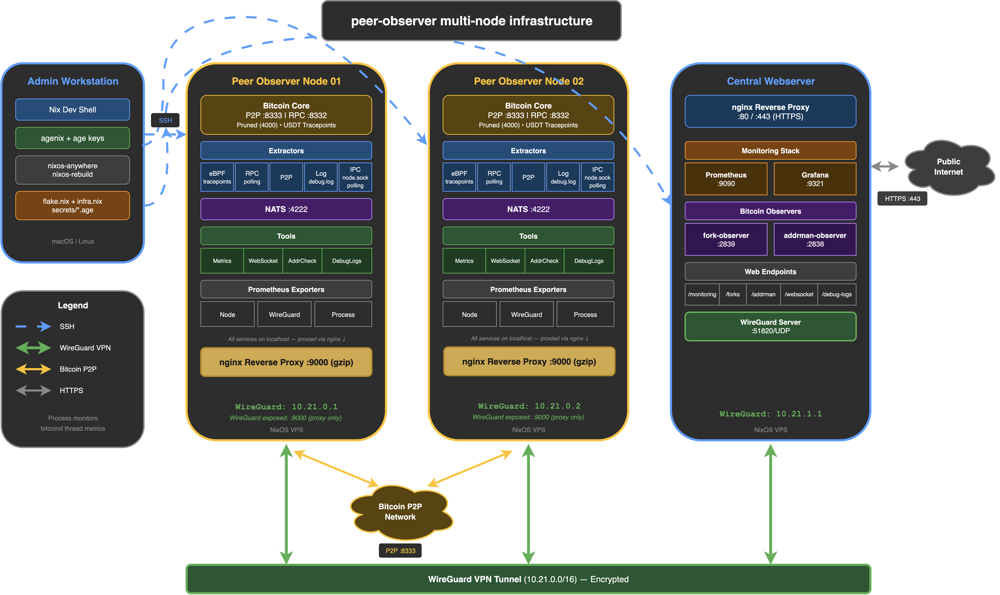

# Architecture

This document describes the peer-observer infrastructure architecture for a typical, multi-node deployment.

## Typical Deployment (multi-node)

## Components Overview

### Admin Workstation

The admin workstation is where you manage your infrastructure configuration and deployment. It includes:
- Nix dev shell - provides deployment and secret-management shell functions (`infra-help` lists them), plus `agenix`, `nixos-rebuild` from the `nixos-rebuild-ng` package, and `nixos-anywhere`
- age keys - for encrypting secrets that nodes can decrypt
- `nixos-anywhere` - for initial deployment to fresh servers
- `nixos-rebuild` - for subsequent configuration updates

Configuration files (`flake.nix`, `infra.nix`) live on your workstation and are pushed to nodes during deployment. See [Secrets Management](secrets.md) for how `agenix` handles encryption and decryption.

### Peer Observer Nodes

Each node is a self-contained monitoring unit running:

#### Bitcoin Core

Instrumented Bitcoin Core node that connects to the Bitcoin P2P network as a passive observer.
- Port 8333 (public, mainnet) - accepts inbound connections from the Bitcoin network. Port varies by network: 18333 (test/testnet3), 48333 (testnet4), 38333 (signet), 18444 (regtest)
- RPC interface bound to `127.0.0.1` only; when fork-observer or addrman-observer need remote RPC access, the webserver queries it through the node's nginx proxy on the WireGuard interface (see [Configuration Concepts](configuration.md))
- Built with USDT tracepoints enabled for eBPF monitoring
- Pruned by default (4000 MiB)

#### Extractors

Extractors extract events from a Bitcoin Core node and publish them to the connected NATS server.

| Extractor | Method | Data Collected |
|-----------|--------|----------------|
| [eBPF](https://github.com/peer-observer/peer-observer/tree/master/extractors/ebpf) | USDT tracepoints | Low-level events (connections, messages, validation) |
| [RPC](https://github.com/peer-observer/peer-observer/tree/master/extractors/rpc) | JSON-RPC polling | Chain state, mempool, peer info |
| [P2P](https://github.com/peer-observer/peer-observer/tree/master/extractors/p2p) | Network tap | Raw P2P message traffic |
| [Log](https://github.com/peer-observer/peer-observer/tree/master/extractors/log) | Log parsing | Debug log events |
| [IPC](https://github.com/peer-observer/peer-observer/tree/master/extractors/ipc) | Bitcoin Core IPC polling | Data queried over the multiprocess IPC socket |

> **Note**: The eBPF extractor requires Bitcoin Core v29.0 or newer for USDT tracepoint support.

#### NATS Server

Message broker that connects extractors to tools via event streaming. Bound to localhost - no network exposure. Extractors publish protobuf-serialized data; tools subscribe to relevant event streams.

#### Tools

Tools connect and subscribe to the NATS server to learn about new events. Each tool uses the events differently:

| Tool | Description |
|------|-------------|
| [metrics](https://github.com/peer-observer/peer-observer/tree/master/tools/metrics) | Produces Prometheus metrics from events. |
| [websocket](https://github.com/peer-observer/peer-observer/tree/master/tools/websocket) | Publishes events into a WebSocket as JSON. |
| [connectivity-check](https://github.com/peer-observer/peer-observer/tree/master/tools/connectivity-check) | Connects to IP addresses received via `addr(v2)` messages and records the result. |
| [logger](https://github.com/peer-observer/peer-observer/tree/master/tools/logger) | Logs events to stdout with optional filtering. CLI debugging tool, not a background service. |

#### Metrics

Each node exposes Prometheus-compatible metrics endpoints. These are firewalled to the WireGuard interface - unreachable from the public internet. The webserver's Prometheus instance scrapes them over the VPN.

### Central Webserver

Aggregates data from all peer-observer nodes into a single interface.

#### nginx

Reverse proxy with Let's Encrypt TLS that routes requests to internal services. Ports 80 and 443 are the only public-facing web ports. All backend services bind to localhost and are accessed exclusively through nginx.

#### Services

All services bind to localhost and are proxied through nginx. See [Configuration Concepts](configuration.md) for webserver options.

| Service | Description |
|---------|-------------|
| Prometheus | Scrapes [metrics endpoints](#metrics) from all nodes via WireGuard. |
| Grafana | Dashboards of Prometheus data. See [dashboards](https://github.com/peer-observer/peer-observer/tree/master/tools/metrics/dashboards). |
| [fork-observer](https://github.com/0xB10C/fork-observer) | Tracks chain tips across all nodes, detects forks and stale blocks, identifies mining pools. Uses node RPC via WireGuard. |
| [addrman-observer](https://github.com/0xB10C/addrman-observer) | Visualizes the address manager state across all nodes via `getrawaddrman` RPC over WireGuard. |
| Debug log viewer | Proxies rotated Bitcoin Core debug logs from each node over WireGuard. Served via nginx at `/debug-logs/<node>/`. |

### Network Connectivity

#### WireGuard VPN

Encrypted VPN where each node peers with the webserver(s), but nodes do not peer with each other. See [Secrets Management](secrets.md) for WireGuard key setup.
- Port UDP 51820 (public on webservers only) - nodes dial out to the webserver and need no inbound UDP
- IP addressing (template convention): nodes `10.21.0.x`, webservers `10.21.1.x`
- All inter-host communication (Prometheus scraping, RPC for fork-observer/addrman-observer, debug log proxying) runs over this tunnel
- Serves as the primary security boundary: all node metrics and RPC ports are firewalled to the WireGuard interface only

#### Bitcoin P2P

Each node connects to the Bitcoin network independently via port 8333 (mainnet). Optionally routes through Tor, I2P, or CJDNS for anonymous connections (see [Configuration Concepts](configuration.md)).

## Security Boundaries

The infrastructure uses three network zones. No metrics, RPC, or internal service port is ever exposed to the public internet.

**Public (internet-facing):**
- Port 8333/TCP on nodes - Bitcoin P2P, required for network participation
- Port 51820/UDP on webservers only - WireGuard tunnel establishment (nodes connect outbound)
- Ports 80 and 443/TCP on the webserver - nginx reverse proxy with TLS

**WireGuard VPN only (`10.21.x.x`):**
All monitoring data flows over the encrypted WireGuard tunnel. Firewall rules on each node restrict metric and RPC endpoints to the WireGuard interface - they are unreachable from the public internet.

**Localhost only (`127.0.0.1`):**
Internal services (NATS, pre-compression metrics, Prometheus, Grafana, fork-observer, addrman-observer) never accept network connections directly. On the webserver, nginx proxies external requests to them. On nodes, they communicate only with co-located processes.

## Fault Tolerance

Nodes are fully self-contained - each runs its own NATS server, extractors, and tools with no cross-node dependencies. If a node goes down, the others are unaffected. The webserver only aggregates; it does not coordinate.

If the webserver goes down, nodes continue collecting data independently - the only impact is loss of the aggregated view until it recovers.

Prometheus tolerates unavailable scrape targets and Grafana shows data gaps rather than failing. See [Troubleshooting](troubleshooting.md) for diagnosing common failures.
